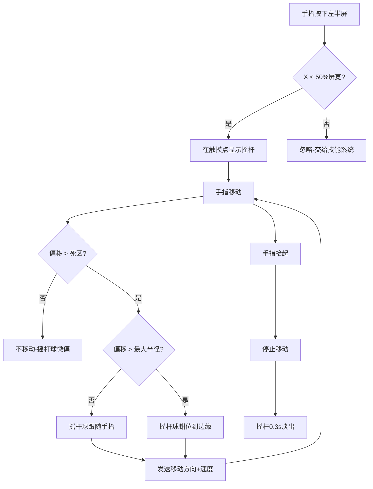
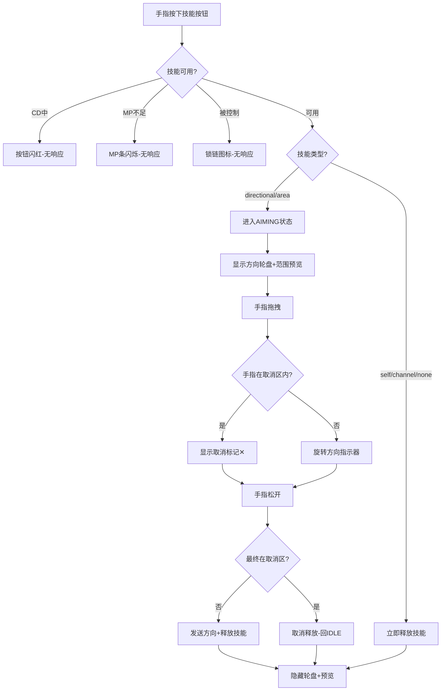
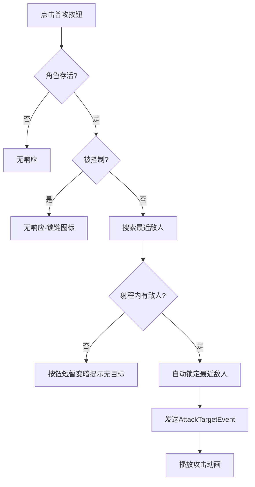
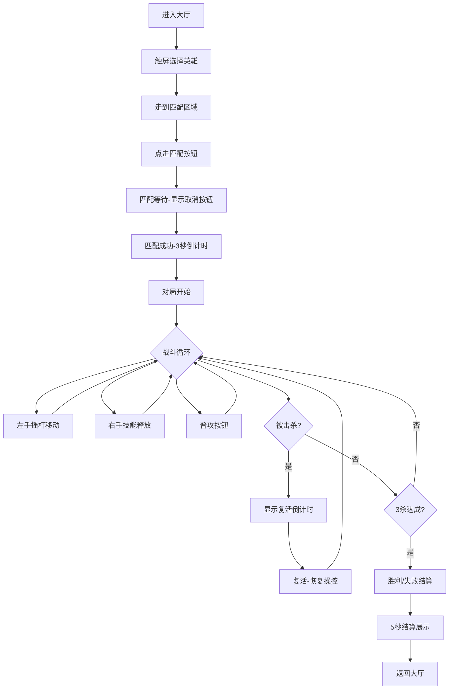

# 手机端MOBA UI与操控系统 - UX设计文档

> 需求ID: REQ-011
> 设计日期: 2026-03-16
> 设计状态: ✅ 已确认
> 设计师: UX小林

---

## 📑 章节索引

| 章节 | 标题 | 小节 |
|------|------|------|
| [第一章](#第一章-设计概述) | 设计概述 | [1.1 设计目标](#11-设计目标) · [1.2 设计原则](#12-设计原则) · [1.3 信息层级](#13-信息层级) |
| [第二章](#第二章-界面设计) | 界面设计 | [2.1 界面列表](#21-界面列表) · [2.2 全屏布局总览](#22-全屏布局总览) · [2.3 虚拟摇杆](#23-虚拟摇杆) · [2.4 技能按钮面板](#24-技能按钮面板) · [2.5 方向轮盘](#25-方向轮盘) · [2.6 战斗HUD](#26-战斗hud) · [2.7 小地图](#27-小地图) · [2.8 辅助UI](#28-辅助ui) |
| [第三章](#第三章-交互流程) | 交互流程 | [3.1 移动流程](#31-移动流程) · [3.2 技能释放流程](#32-技能释放流程) · [3.3 普攻流程](#33-普攻流程) · [3.4 完整对局流程](#34-完整对局流程) · [3.5 异常流程](#35-异常流程) |
| [第四章](#第四章-交互规范) | 交互规范 | [4.1 状态定义](#41-状态定义) · [4.2 反馈规范](#42-反馈规范) · [4.3 触摸区域规范](#43-触摸区域规范) · [4.4 动画时序](#44-动画时序) |

---

# 第一章 设计概述

## 1.1 设计目标

| 目标 | 描述 | 衡量标准 |
|------|------|---------|
| **即时上手** | 王者荣耀玩家0学习成本，5秒内找到摇杆和技能按钮 | 布局与王者荣耀标准一致 |
| **战斗不中断** | 任何操作在 1-2 步内完成，不打断战斗节奏 | 移动+技能可同时操作(多点触控) |
| **视觉不遮挡** | UI 控件不遮挡战斗画面核心区域 | 中央 60% 区域无固定 UI |
| **状态一目了然** | 技能CD/HP/MP 一眼可见 | CD扇形+数字双重指示 |

## 1.2 设计原则

- **简洁性**: 战斗中只显示必要操控元素（摇杆+技能+HP/MP），非战斗信息隐藏或缩小
- **一致性**: 所有技能按钮统一交互模式（按住→拖拽→松手），普攻是唯一的"点按即触发"
- **反馈性**: 每个操作都有即时视觉+触觉反馈（按钮缩放/颜色变化/震动）
- **容错性**: 方向轮盘拖回可取消，死区防误触，CD 按钮不可点击

## 1.3 信息层级（战斗中）

```
优先级1（始终显示）: 虚拟摇杆 | 技能按钮+CD | 普攻按钮 | HP/MP条
优先级2（始终显示）: 击杀比分 | 对局时间 | 等级
优先级3（事件触发）: 击杀播报 | 复活倒计时 | 技能范围预览
优先级4（按需显示）: 小地图 | 装备栏
优先级5（主动打开）: 背包/商店 | 训练场面板
```

---

# 第二章 界面设计

## 2.1 界面列表

| 界面名称 | 类型 | 入口 | 层级(ZIndex) | 说明 |
|----------|------|------|-------------|------|
| 虚拟摇杆 | 嵌入/动态出现 | 左半屏触摸 | 10 | 移动控制 |
| 技能按钮面板 | 嵌入/固定 | 始终显示 | 10 | Q/W/R + 普攻 + D/F |
| 方向轮盘 | 临时覆盖 | 按住技能按钮 | 15 | 瞄准指示器 |
| 战斗HUD | 全屏覆盖 | 自动显示 | 5 | 信息展示层 |
| 小地图 | 嵌入/固定 | 始终显示(对局中) | 5 | 位置信息 |
| 辅助UI | 全屏/弹窗 | 按钮触发 | 20 | 英雄选择/背包/匹配 |

## 2.2 全屏布局总览

> 想象一下：玩家横握手机，左手大拇指自然落在屏幕左下方，右手大拇指落在右下方。这就是操控的起点。

```
┌─────────────────────────────────────────────────────────────────────┐
│ ┌──────┐ ┌────────────────┐          ┌───────────────────┐          │
│ │ 头像 │ │████████████ HP │          │  03:42  │ 2 vs 1 │  [Lv.5] │
│ │ Lv.5 │ │██████░░░░░░ MP │          └───────────────────┘          │
│ └──────┘ └────────────────┘                                         │
│ ┌─────────┐                                                         │
│ │         │                                                         │
│ │ 小地图  │                    [ 击杀播报区域 ]                      │
│ │         │                                                         │
│ └─────────┘                                                         │
│                                                                     │
│                          （战斗画面区域）                             │
│                                                                     │
│                                                                     │
│                                                           [W]       │
│                                                        [Q]   [R]    │
│       ┌───────┐                                      [D] [F]        │
│       │  ○──  │ ← 虚拟摇杆           [装备栏 6格]    [普攻]         │
│       └───────┘                                                     │
│ ←── 左半屏触摸区(0~50%) ──→ ←── 右半屏技能区(50~100%) ──→          │
└─────────────────────────────────────────────────────────────────────┘
```

### Roblox UDim2 关键锚点

| 元素 | 位置 (AnchorPoint) | Position (UDim2) | Size (UDim2) |
|------|-------------------|-------------------|--------------|
| 英雄头像 | (0, 0.5) | (0.02, 0, 0.04, 0) | (0, 0, 0.08, 0.08) |
| HP条 | (0, 0.5) | (0.11, 0, 0.04, 0) | (0.15, 0, 0, 0.02) |
| MP条 | (0, 0.5) | (0.11, 0, 0.07, 0) | (0.15, 0, 0, 0.015) |
| 对局时间 | (0.5, 0) | (0.5, 0, 0.02, 0) | (0.1, 0, 0, 0.035) |
| 击杀比分 | (0.5, 0) | (0.5, 0, 0.055, 0) | (0.12, 0, 0, 0.03) |
| 小地图 | (0, 0) | (0.02, 0, 0.12, 0) | (0, 0, 0.18, 0.18) |
| 摇杆触摸区 | (0, 1) | (0, 0, 1, 0) | (0.5, 0, 0.5, 0) |
| 普攻按钮 | (1, 1) | (0.94, 0, 0.92, 0) | (0, 0, 0.14, 0.14) |
| R按钮 | (1, 1) | (0.88, 0, 0.78, 0) | (0, 0, 0.11, 0.11) |
| W按钮 | (1, 1) | (0.82, 0, 0.67, 0) | (0, 0, 0.11, 0.11) |
| Q按钮 | (1, 1) | (0.75, 0, 0.78, 0) | (0, 0, 0.11, 0.11) |
| D按钮 | (1, 1) | (0.70, 0, 0.85, 0) | (0, 0, 0.08, 0.08) |
| F按钮 | (1, 1) | (0.70, 0, 0.93, 0) | (0, 0, 0.08, 0.08) |

---

## 2.3 虚拟摇杆

### 布局

```
左半屏触摸区（0%~50% X）

手指按下时在触摸点出现：

    ┌─────────────┐
    │  ╭───────╮  │
    │  │       │  │  ← 外圈 (半透明白色圆环, α=0.4)
    │  │  ●──  │  │  ← 摇杆球 (实心白色, α=0.8)
    │  │       │  │     ●表示中心, ──表示手指拖拽方向偏移
    │  ╰───────╯  │
    └─────────────┘

外圈直径 = 屏幕高度 × 25%
摇杆球直径 = 外圈 × 40%
```

### 元素列表

| 元素 | 类型 | Roblox类 | 交互 | 视觉规格 |
|------|------|---------|------|---------|
| 触摸捕获层 | 透明Frame | Frame | TouchTap/TouchPan | 左半屏全覆盖, 完全透明 |
| 外圈 | 圆环图 | ImageLabel | 被动显示 | 白色圆环, α=0.4, 直径25%H |
| 摇杆球 | 实心圆 | ImageLabel | 跟随手指 | 白色实心, α=0.8, 直径10%H |
| 方向指示线 | 细线 | Frame(旋转) | 被动显示 | 从中心到摇杆球的半透明线(可选) |

---

## 2.4 技能按钮面板

### 弧形布局详图

```
右下角技能区域:

             [W]                ← 弧形顶部
          [Q]   [R]            ← 弧形两翼
        [D] [F]                ← 召唤师技能，紧贴Q左下
                [普攻]          ← 最大按钮，最右下

按钮间距: 约按钮直径的 20%
弧形半径: 约普攻按钮中心到W按钮中心距离
```

### 单个技能按钮结构

```
┌─────────────────┐
│  ┌───────────┐  │
│  │ 技能图标  │  │  ← 正常状态：全彩图标
│  │   (Q)     │  │
│  │           │  │
│  └───────────┘  │
│  ┌───────────┐  │
│  │ CD遮罩    │  │  ← CD中：灰色扇形从12点钟顺时针消退
│  │   3.2     │  │  ← CD秒数（白色粗体，1位小数）
│  └───────────┘  │
│  [MP消耗: 60]   │  ← 按钮下方小字，显示MP消耗量
└─────────────────┘
```

### 元素列表

| 元素 | 类型 | 大小(屏高比) | 交互 | 视觉规格 |
|------|------|------------|------|---------|
| Q技能按钮 | 圆形按钮 | 11% | 按住→拖拽→松手 | 圆形, 技能图标填充, 边框2px白 |
| W技能按钮 | 圆形按钮 | 11% | 按住→拖拽→松手 | 同上 |
| R技能按钮 | 圆形按钮 | 11% | 按住→拖拽→松手 | 同上，大招边框金色 |
| 普攻按钮 | 圆形按钮 | 14% | 点按 | 白色/金色攻击图标, 边框3px |
| D召唤师技能 | 圆形按钮 | 8% | 点按/按住 | 召唤师技能图标 |
| F召唤师技能 | 圆形按钮 | 8% | 点按/按住 | 召唤师技能图标 |
| CD扇形遮罩 | 遮罩层 | 同按钮 | 被动 | 灰色半透明(α=0.7), 顺时针消退 |
| CD秒数文字 | TextLabel | 按钮50% | 被动 | 白色粗体, 1位小数 |
| MP消耗文字 | TextLabel | 按钮宽 | 被动 | 蓝色小字, 显示在按钮正下方 |

---

## 2.5 方向轮盘

> 想象场景：后羿玩家按住 R（烈日裁决），手指从按钮向左上方拖出，一条金色光线从按钮中心延伸到手指方向，同时英雄脚下出现技能射程预览——玩家确认方向后松手，大招飞出！

### 轮盘结构

```
手指按住R按钮，向左上方拖出：

                     ← 手指位置
                   ╱
                 ╱   ← 方向指示线（金色/白色发光线条）
               ╱
             ╱
           [R]        ← 按钮中心（原点）
          ╱
        ╱
    [取消区]          ← 拖回按钮中心30%范围 = 取消

同时在角色位置显示:
    ┌─ ─ ─ ─ ─ ─ ─ ┐
    │   技能范围     │  ← 半透明扇形/矩形/圆形（取决于SkillConfig.aimType）
    │   预览图       │     颜色：绿色(友方)/红色(敌人在范围内)
    │ ← 角色位置 →  │
    └─ ─ ─ ─ ─ ─ ─ ┘
```

### 元素列表

| 元素 | 类型 | 视觉规格 | 出现条件 |
|------|------|---------|---------|
| 方向指示线 | 旋转Frame | 白色发光线, 长度=手指偏移距离, 宽2px, α=0.8 | 手指偏移 > 取消区 |
| 方向箭头 | ImageLabel | 线条末端三角箭头 | 手指偏移 > 取消区 |
| 取消区标记 | Frame | 按钮中心半透明红色圆(30%半径), 显示"✕"图标 | 手指偏移 < 取消区 |
| 技能范围预览 | 3D世界指示器 | 绿色半透明几何体(扇形/圆形/矩形), α=0.3 | 始终显示 |
| 范围边缘高亮 | 3D世界 | 范围边缘明亮线条, α=0.6 | 始终显示 |

---

## 2.6 战斗HUD

### 顶部信息栏详图

```
┌─────────────────────────────────────────────────────────────┐
│                                                             │
│  ┌────┐ ████████████████░░░░ HP                             │
│  │头像│ █████████░░░░░░░░░░ MP        03:42                 │
│  │Lv5 │                             ┌─────────┐            │
│  └────┘                             │ 2 vs 1  │   Lv.5     │
│                                     └─────────┘            │
└─────────────────────────────────────────────────────────────┘

HP条颜色规则:
  100%~60%: 绿色 (0, 200, 0)
  60%~30%:  黄色 (255, 200, 0)
  30%~0%:   红色 (255, 50, 50) + 脉冲闪烁动画

MP/能量条颜色: 蓝色 (80, 130, 255)
  特殊能量类型按 EnergyConfig 配色
```

### 击杀播报

```
                ┌───────────────────────────┐
                │ [后羿头像] 击杀了 [廉颇头像] │  ← 从上方滑入
                └───────────────────────────┘
                        ↓ 停留 2s
                        ↓ 向上淡出

最多堆叠 2 条，新通知从上方推入，旧通知被顶到更上方后淡出
```

### 复活倒计时

```
┌─────────────────────────────────────┐
│          ┌───────────────┐          │
│          │               │          │  ← 半透明黑色遮罩 (α=0.5)
│          │      5        │          │  ← 大号白色数字 (倒计时)
│          │               │          │
│          │  复活倒计时    │          │  ← 小号白色文字
│          └───────────────┘          │
│                                     │
└─────────────────────────────────────┘
```

---

## 2.7 小地图

```
┌───────────┐
│  ┌─────┐  │
│  │     │  │  ← 竞技场缩略图（灰色底，简化地形）
│  │  ●  │  │  ← 己方蓝色圆点
│  │     │  │
│  │   ○ │  │  ← 敌方红色圆点
│  └─────┘  │
│  [展开]   │  ← 小按钮，点击可放大地图（P2预留）
└───────────┘

位置: 左上角，英雄状态区下方
大小: 屏高 18% × 18%
更新频率: 0.5s
```

---

## 2.8 辅助UI

### 英雄选择界面（手机适配）

```
┌─────────────────────────────────────────────────────┐
│ [全部] [法师] [射手] [坦克]  ← Tab横排滑动    [✕]   │
├─────────────────────────────────────────────────────┤
│ ┌─────┐ ┌─────┐ ┌─────┐ ┌─────┐                    │
│ │安琪拉│ │拉克丝│ │后羿 │ │廉颇 │  ← 2行网格        │
│ │ ★★☆│ │ ★★★│ │ ★☆☆│ │ ★★☆│                    │
│ └─────┘ └─────┘ └─────┘ └─────┘                    │
│                                                     │
│              [选择确认] ← 大号按钮                    │
└─────────────────────────────────────────────────────┘

每个英雄卡片: 最小 48×48dp (Scale约0.12)
点击卡片高亮选中 → 底部确认按钮激活
```

### 装备购买界面

```
对局中底部装备栏:
[装1][装2][装3][装4][装5][装6]  ← 6格横排，点击空格打开商店

商店面板（全屏覆盖）:
┌─────────────────────────────────────┐
│ [攻击] [防御] [法术] [辅助]  [✕]    │
├─────────────────────────────────────┤
│ ┌──────┐ ┌──────┐ ┌──────┐         │
│ │无尽  │ │狂徒  │ │...   │         │
│ │之刃  │ │铠甲  │ │      │         │
│ │1000金│ │800金 │ │      │  ← 网格 │
│ └──────┘ └──────┘ └──────┘         │
│                                     │
│ 金币: 1500                          │
└─────────────────────────────────────┘

点击装备卡片 → 弹出确认（名称+属性+购买按钮）
```

---

# 第三章 交互流程

## 3.1 移动流程



## 3.2 技能释放流程



## 3.3 普攻流程



## 3.4 完整对局流程



## 3.5 异常流程

| 异常情况 | 处理方式 | 用户提示 |
|----------|----------|----------|
| 技能CD中按下 | 忽略输入 | 按钮短暂闪红(0.15s) |
| MP不足按下技能 | 忽略输入 | MP条闪烁蓝光(0.3s×3次) |
| 死亡状态操控 | 全部忽略 | 屏幕半透明遮罩+复活倒计时 |
| 眩晕/击飞中操控 | 移动忽略，技能忽略 | 按钮显示锁链图标 |
| 同时按两个技能 | 先按的优先 | 后按的按钮无响应 |
| 手指滑出屏幕 | 等同松手 | 摇杆消失/技能取消释放 |
| 方向拖拽距离极小 | 视为取消 | 按钮恢复默认状态 |
| 网络延迟CD不同步 | 以服务端为准 | CD可能短暂跳变 |

---

# 第四章 交互规范

## 4.1 状态定义

### 技能按钮状态

| 状态 | 视觉表现 | 可交互 | 触发条件 |
|------|---------|--------|---------|
| **默认(Idle)** | 全彩技能图标, 白色边框 | ✅ | 技能可用时 |
| **按下(Pressed)** | 按钮缩小至90%, 亮度+20% | — | 手指按下瞬间 |
| **瞄准中(Aiming)** | 按钮缩小85%, 边框发光, 方向轮盘显示 | 拖拽中 | 按住并拖出 |
| **CD中(Cooldown)** | 灰色扇形遮罩+白色秒数, 图标暗淡 | ❌ | 技能释放后 |
| **CD好了(Ready)** | 遮罩消失+边框闪光一次(0.3s) | ✅ | CD倒计时归零 |
| **MP不足(NoMana)** | 图标暗淡(α=0.4), 蓝色边框闪烁 | ❌ | 当前MP < 技能消耗 |
| **被控制(Disabled)** | 图标暗淡, 锁链图标覆盖 | ❌ | 眩晕/沉默/击飞状态 |
| **死亡(Dead)** | 全部暗淡, 不可交互 | ❌ | 角色死亡 |

### 虚拟摇杆状态

| 状态 | 视觉表现 | 触发条件 |
|------|---------|---------|
| **隐藏** | 不可见 | 默认/松手后0.3s |
| **出现** | 在触摸点淡入(0.1s) | 手指按下左半屏 |
| **活动** | 摇杆球跟随手指, 外圈固定 | 手指持续按住 |
| **消失** | 从当前位置淡出(0.3s) | 手指抬起 |

### 普攻按钮状态

| 状态 | 视觉表现 | 可交互 |
|------|---------|--------|
| **默认** | 白色/金色攻击图标, 大号 | ✅ |
| **按下** | 缩小至92%, 金色闪光 | — |
| **攻击CD** | 轻微暗淡(0.15s), 然后恢复 | ✅(连续点按) |
| **无目标** | 短暂变暗(0.2s) | ✅ |
| **被控制** | 锁链图标 | ❌ |

## 4.2 反馈规范

| 操作 | 反馈类型 | 反馈内容 | 持续时间 |
|------|----------|----------|----------|
| 按下技能按钮 | 视觉+触觉 | 按钮缩小90% + 设备震动(轻) | 即时 |
| 释放技能 | 视觉+音效 | 按钮闪光 + 释放音效 | 0.2s |
| 技能CD好了 | 视觉 | 边框金色闪光脉冲 | 0.3s |
| 普攻命中 | 视觉+音效 | 普攻按钮微缩+白闪 + 击中音效 | 0.15s |
| 被击中(受伤) | 视觉+触觉 | 屏幕边缘红色闪光 + 设备震动(中) | 0.2s |
| 击杀敌人 | 视觉+音效 | 屏幕中央"KILL"文字 + 击杀播报 + 音效 | 1.5s |
| 被击杀 | 视觉+触觉 | 屏幕灰度化 + 设备震动(强) + 复活倒计时 | 直到复活 |
| CD中按技能 | 视觉 | 按钮短暂闪红 | 0.15s |
| MP不足按技能 | 视觉 | MP条蓝色闪烁×3 | 0.9s |
| 摇杆进入死区 | 视觉 | 摇杆球回弹到中心 | 0.1s |

## 4.3 触摸区域规范

| 元素 | 最小触摸区域 | 实际大小 | 说明 |
|------|------------|---------|------|
| 技能按钮(QWR) | 44×44dp | ~11%屏高 | Roblox 手机屏幕高度约600dp，11%≈66dp ✅ |
| 普攻按钮 | 44×44dp | ~14%屏高≈84dp | 超出最小要求 ✅ |
| 召唤师技能(DF) | 44×44dp | ~8%屏高≈48dp | 勉强满足 ✅ |
| 英雄卡片 | 48×48dp | Scale 0.12 | 满足 ✅ |
| 装备格子 | 44×44dp | 自适应 | 满足 ✅ |
| 关闭按钮 | 44×44dp | 右上角 X | 必须 ✅ |

> **原则**: 所有可点击元素之间间距 ≥ 8dp，防止误触

## 4.4 动画时序

| 动画 | 方法 | 缓动 | 时长 | 说明 |
|------|------|------|------|------|
| 摇杆出现 | Alpha 0→1 | EaseOut | 0.1s | 快速出现 |
| 摇杆消失 | Alpha 1→0 | EaseIn | 0.3s | 缓慢消失 |
| 按钮按下 | Scale 1→0.9 | EaseOut | 0.08s | 快速缩小 |
| 按钮释放 | Scale 0.9→1 + Flash | EaseOut | 0.15s | 回弹+闪光 |
| CD遮罩旋转 | Rotation 0→360 | Linear | 技能CD时长 | 匀速旋转 |
| CD好了闪光 | 边框Glow | EaseOut | 0.3s | 金色脉冲 |
| 击杀播报滑入 | Y 从上→目标位置 | EaseOut | 0.3s | 从上方滑入 |
| 击杀播报淡出 | Alpha 1→0 + Y上移 | EaseIn | 0.5s | 上移消失 |
| HP条变化 | Width动画 | EaseOut | 0.15s | 平滑缩减 |
| 复活倒计时 | 数字缩放脉冲 | EaseInOut | 1s/次 | 每秒脉冲 |

---

## 📋 策划确认

- [x] 界面布局符合需求
- [x] 交互流程完整
- [x] 用户体验流畅
- [x] 无遗漏功能点
- [x] MOBA战斗状态全覆盖(CD/MP不足/被控/死亡)
- [x] 触摸区域满足最小规格

**确认人**: 策划小张
**确认日期**: 2026-03-16
**确认意见**: 通过。设计完整详尽，MOBA交互覆盖全面，触摸规格合理。Roblox UDim2标注详尽，程序可直接使用。
